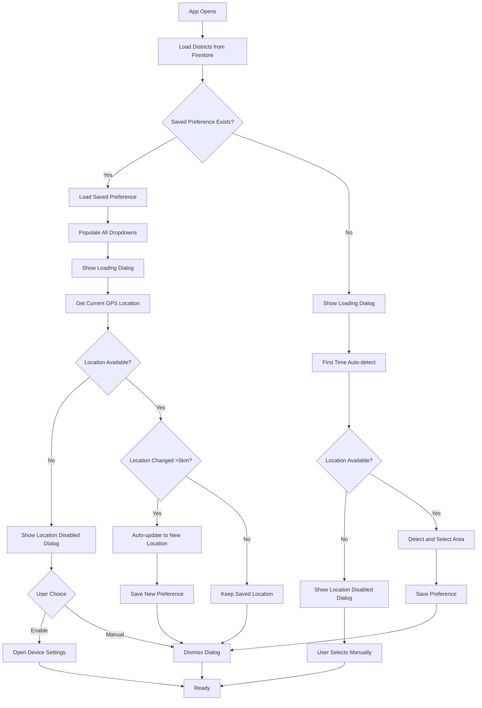

# Location Selection Enhancement Plan

## Overview

Fix the location selection interface to show all dropdowns always visible with proper disabled states, save user preferences, and intelligently check location on app reopen.

## Changes Required

### 1. Update Local Storage Service

**File:** [`lib/services/local_storage_service.dart`](lib/services/local_storage_service.dart)Add methods to save and retrieve location preferences:

- `saveLocationPreference(String divisionName, String districtId, String areaId)` - Save user's selected location
- `getLocationPreference()` - Return saved location as Map with division, district, area IDs
- `clearLocationPreference()` - Clear saved preference

### 2. Update Home Screen UI

**File:** [`lib/screens/public/home_screen_new.dart`](lib/screens/public/home_screen_new.dart)**Dropdown Visibility Changes:**

- Division dropdown: Keep always visible and enabled (no change)
- District dropdown: Change from conditional rendering (`if (_selectedDivision != null)`) to always visible but disabled when no division selected
- Area dropdown: Change from conditional rendering (`if (_selectedDistrict != null)`) to always visible but disabled when no district selected

**Dropdown Widget Updates:**

- Update `_buildDropdown` to accept `enabled` parameter
- Update `_buildDistrictDropdown` to accept `enabled` parameter  
- Update `_buildAreaDropdown` to accept `enabled` parameter
- Use `IgnorePointer` widget or `onChanged: enabled ? callback : null` to disable interaction

### 3. Implement Preference Persistence

**File:** [`lib/screens/public/home_screen_new.dart`](lib/screens/public/home_screen_new.dart)**Save Logic:**

- When user manually selects an area, save preference immediately
- When app auto-selects area (in `_attemptAutoLocation`), save preference after successful selection
- Add `_saveLocationPreference()` method

**Load Logic:**

- Modify `_initializeLocation()` to:

1. Load districts from Firestore
2. Check if location preference exists in local storage
3. If exists, load it and populate dropdowns
4. Then check current GPS location
5. If current location differs significantly (>5km from saved area), auto-update
6. If no preference exists, do normal auto-location detection

- Add `_loadSavedPreference()` method
- Add `_shouldUpdateLocation()` method to check if location changed significantly

### 4. Update Auto-Location Logic

**File:** [`lib/screens/public/home_screen_new.dart`](lib/screens/public/home_screen_new.dart)Modify `_attemptAutoLocation()`:

- Accept optional parameter `updateExisting: bool` to distinguish between first-time and update scenarios
- Show different messages for "Location auto-selected" vs "Location updated based on your current position"
- Save preference after successful auto-selection

### 5. Create Location Detection Dialog

**File:** [`lib/widgets/location_detection_dialog.dart`](lib/widgets/location_detection_dialog.dart) (new file)Create a custom dialog widget with:

- Animated loading indicator (CircularProgressIndicator or Lottie animation)
- Friendly message: "Detecting your location..."
- Modern, clean design matching app theme
- Non-dismissible by default (user can't tap outside to close)

### 6. Integrate Loading Dialog

**File:** [`lib/screens/public/home_screen_new.dart`](lib/screens/public/home_screen_new.dart)**Dialog Flow:**

- Show loading dialog when location detection starts
- Dialog displays while:
- Requesting location permission (if needed)
- Getting GPS coordinates
- Finding nearest mosque
- Auto-selecting area
- Dismiss dialog when:
- Area successfully detected and selected
- Error occurs (location disabled, permission denied, etc.)

**Location Disabled Handling:**

- If location services are disabled, show a different dialog:
- Message: "Location services are disabled"
- Two buttons: "Enable Location" (opens settings) and "Select Manually" (dismisses)
- Dialog is optional/skippable - user can choose manual selection

## Implementation Flow

## Key Features

1. **Always Visible Dropdowns:** All three dropdowns visible at all times with proper disabled states
2. **Smart Persistence:** Saves preference on both manual and automatic selection
3. **Intelligent Updates:** On app reopen, loads saved preference but updates if user moved significantly
4. **Loading Dialog:** Beautiful loading dialog shows during location detection process
5. **Location Disabled Handling:** Friendly optional dialog when location services are off, with option to enable or proceed manually
6. **Better UX:** Users see their last selection immediately, with smooth dialog-based location updates

## Testing Checklist

- [ ] All dropdowns visible on first app launch
- [ ] District disabled until division selected
- [ ] Area disabled until district selected
- [ ] Loading dialog appears when detecting location
- [ ] Loading dialog dismisses after location found
- [ ] Location disabled dialog shows when services are off
- [ ] "Enable Location" button opens device settings
- [ ] "Select Manually" allows user to skip auto-detection
- [ ] Auto-location saves preference correctly
- [ ] Manual selection saves preference correctly
- [ ] App reopens with saved location displayed
- [ ] Moving >5km triggers automatic location update with dialog